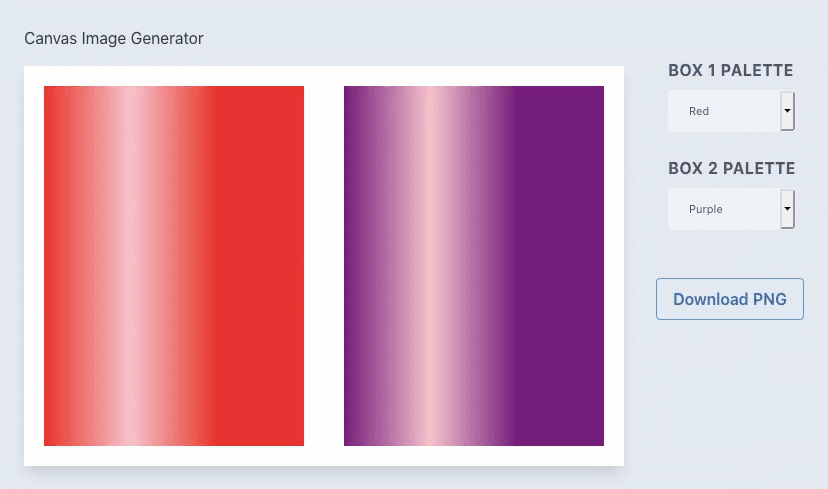

# Canvas Gen

This sample project renders two gradients on a canvas and lets the user download the canvas as a PNG image. This code is helpful for developers learning Javascript. It demonstrates the following concepts:

* Custom HTMl Element
* Canvas rendering
* Canvas image export
* Tailwind CSS
* Javascript Class

Here's a live [Demo](https://techbubble.github.io/canvasgen/). 

Would love to hear your feedback, or if you run into any problems. Twitter: @techbubble
